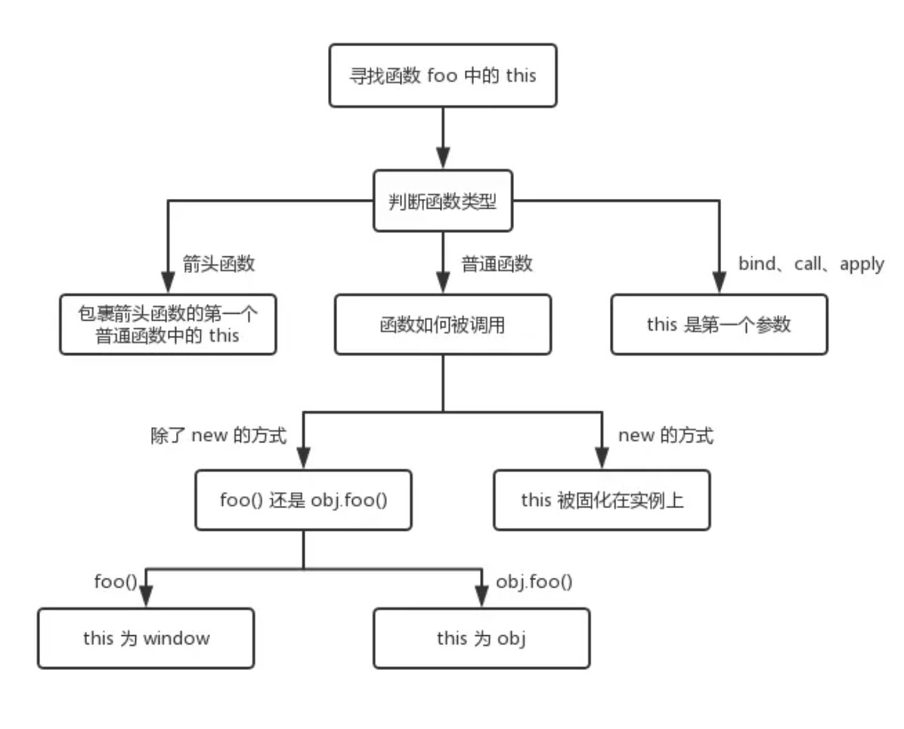

# js相关

## 原始类型有哪几种？null 是对象嘛？
- 原始类型：JavaScript 中有七种原始类型：Undefined, Null, Boolean, Number, BigInt, String, 和 Symbol。
- Null：null 是一个表示“没有对象”的特殊值。虽然 typeof null 返回 "object"，但这只是一个历史遗留问题，null 实际上并不是对象。

## 对象类型和原始类型的不同之处？函数参数是对象会发生什么问题？
### 1. 存储方式
- **原始类型** ：存储的是值本身。

    - 原始类型的数据直接存储在变量中。它们在内存中分配固定大小的空间，因此它们的操作是按值操作。
    - 例如，数字、字符串、布尔值、null 和 undefined 都是原始类型。
- **对象类型**：存储的是引用（即内存地址）。

    - 对象类型的数据在变量中存储的是对内存中实际数据位置的引用。对象本身可以很大，所以它们的操作是按引用操作。
    - 例如，对象、数组、函数等都是对象类型。
### 2.可变性
- **原始类型**：是不可变的（immutable）。
    - 一旦创建，原始类型的值就不能被改变。例如，字符串一旦创建就不能被修改，所有对字符串的操作都会生成一个新的字符串。
- **对象类型**：是可变的（mutable）。
    - 对象的属性和方法可以被修改，添加或删除。
### 3.比较方式
- **原始类型**：比较的是值本身。
    - 如果两个原始类型的值相等，那么它们就是相等的。
- **对象类型**：比较的是引用（即内存地址）。
    - 如果两个对象的引用相同，那么它们就是相等的；否则，即使它们的内容相同，它们也是不相等的。
### 4.函数参数
- 当函数参数是对象时，传递的是对象的引用。这意味着函数内部对参数的修改会影响到外部对象。

## typeof 是否能正确判断类型？instanceof 能正确判断对象的原理是什么？
- **typeof**：在大多数情况下可以正确判断原始类型，但对于对象类型只能判断是否为对象或函数，无法进一步细分。此外，typeof null 返回 "object" 是一个历史遗留的 bug。
- **instanceof**：通过原型链判断一个对象是否是某个构造函数的实例，非常强大和准确，但在跨全局环境时可能会失效。此外，可以通过自定义 Symbol.hasInstance 来改变其行为。

## 如何正确判断 this？箭头函数的 this 是什么？

- 箭头函数的 this 具有不同的行为，它捕获创建箭头函数时上下文的 this 值，而不是调用时的 this 值。箭头函数没有自己的 this，它从包含它的最近的常规（非箭头）函数的 this 值中继承。

## 浅拷贝和深拷贝

- **浅拷贝**
浅拷贝是指创建一个新对象，这个对象有着原始对象属性值的精确副本。如果属性是基本类型，拷贝的就是基本类型的值；如果属性是引用类型，拷贝的就是内存地址，因此如果其中一个对象改变了这个地址，另一个对象也会受到影响。

- **实现浅拷贝的方法**
1. 使用 Object.assign() 方法
```js
const obj = { a: 1, b: { c: 2 } };
const shallowCopy = Object.assign({}, obj);

console.log(shallowCopy); // { a: 1, b: { c: 2 } }
shallowCopy.b.c = 3;
console.log(obj.b.c); // 3 (原对象也被修改)
```
2. 使用展开运算符（spread operator）
```js
const obj = { a: 1, b: { c: 2 } };
const shallowCopy = { ...obj };

console.log(shallowCopy); // { a: 1, b: { c: 2 } }
shallowCopy.b.c = 3;
console.log(obj.b.c); // 3 (原对象也被修改)
```
3. 使用 Array.prototype.slice() 方法
4. 使用 Array.prototype.concat() 方法

- **深拷贝**
深拷贝是指创建一个新对象，这个对象有着原始对象属性值的完全独立的副本。如果属性是基本类型，拷贝的就是基本类型的值；如果属性是引用类型，会拷贝引用类型到内存中，并递归地拷贝所有属性。这意味着如果其中一个对象改变了这个地址，另一个对象不会受到影响。

- **实现深拷贝的方法**
1. 使用 JSON.parse() 和 JSON.stringify() 方法(这种方法只能处理不包含函数、undefined、Symbol 和循环引用的对象。)
```js
const obj = { a: 1, b: { c: 2 } };
const deepCopy = JSON.parse(JSON.stringify(obj));

console.log(deepCopy); // { a: 1, b: { c: 2 } }
deepCopy.b.c = 3;
console.log(obj.b.c); // 2 (原对象未被修改)
```
2. 使用递归函数
```js
function deepClone(value){
  if(value === null || typeof value !== 'object') {
    return value
  }
  const result = Array.isArray(value) ? [] : {}
  for(let key in value) {
    if(value.hasOwnProperty(key)) {
      result[key] = deepClone(value[key])
    }
  }
  return result;
}
```
3. 使用 Lodash 库的 cloneDeep() 方法
4. 使用 jQuery 的 extend() 方法

## 请解释一下JavaScript中的闭包（closure），以及闭包的实际应用场景。

闭包是指在函数内部定义的函数可以访问其外部函数的变量。换句话说，闭包是由函数和其词法环境的组合而成，这个环境包含了这个函数在定义时所能访问的所有局部变量。

数据隐藏和封装：
函数工厂
闭包可以用于模块化开发，定义模块的私有成员和公开接口。

## 请解释一下JavaScript的事件冒泡（event bubbling）和事件捕获（event capturing）机制，并说明如何使用事件委托（event delegation）优化事件处理。

- 事件冒泡:事件冒泡是指事件从最具体的元素（事件的目标元素）开始，逐级向上传播到最不具体的元素（通常是文档或窗口）。在事件冒泡阶段，事件处理程序按照从内到外的顺序执行。
- 事件捕获:事件捕获是指事件从最不具体的元素（通常是文档或窗口）开始，逐级向下传播到最具体的元素（事件的目标元素）。在事件捕获阶段，事件处理程序按照从外到内的顺序执行。
- 事件委托:事件委托是一种利用事件冒泡机制，将事件处理程序添加到父元素，而不是每个子元素上，从而优化性能和简化代码。当子元素数量众多或频繁变化时，事件委托尤其有用。
- 事件冒泡：事件从最具体的元素向上传播到最不具体的元素。
- 事件捕获：事件从最不具体的元素向下传播到最具体的元素。
- 事件委托：利用事件冒泡，将事件处理程序添加到父元素，从而优化性能和简化代码。

## 请解释一下JavaScript的原型（prototype）和原型链（prototype chain），以及它们在继承中的作用。

- JavaScript的原型（prototype）和原型链（prototype chain）：在JavaScript中，每个对象都有一个隐藏的属性[[Prototype]]（通常可以通过__proto__访问），它指向该对象的原型对象。原型对象本身也有一个[[Prototype]]，指向更高一级的原型对象，如此形成一个链条，称为原型链。

- 原型和原型链的工作原理：当你访问一个对象的属性时，JavaScript会首先在该对象自身上查找该属性。如果找不到，它会沿着原型链向上查找，直到找到该属性或到达原型链的顶端（即Object.prototype）。
原型链中的继承：原型链在继承中起到重要作用，使对象可以共享方法和属性，从而实现代码复用。

## 请解释一下JavaScript的事件循环（Event Loop）机制，以及它是如何处理异步任务的。
- 执行宏任务（Task）：从任务队列（Task Queue）中取出第一个宏任务并执行。宏任务包括初始化代码、setTimeout、setInterval、I/O操作等。
- 查询是否有微任务（Microtask）：在每个宏任务执行完后，事件循环会检查微任务队列（Microtask Queue）是否为空。微任务包括Promise的回调函数、MutationObserver等。
- 执行微任务：如果有微任务，将它们全部执行完。执行过程中产生的新微任务会被添加到微任务队列中，直到队列为空。
- 检查是否需要重新渲染页面：在每次宏任务和所有微任务执行完之后，浏览器会检查是否需要重新渲染页面（UI更新）。
- 重复上述步骤：事件循环重复上述步骤，不断地从宏任务队列中取任务执行。
- 宏任务（Task）：包括setTimeout、setInterval、I/O等。
- 微任务（Microtask）：包括Promise的回调、MutationObserver等。
- 事件循环（Event Loop）：不断执行宏任务和微任务，确保JavaScript能够高效地处理异步任务。
## 什么是提升？什么是暂时性死区？var、let 及 const 区别？
- 提升（Hoisting）：在JavaScript中，变量和函数声明会被提升到其作用域的顶部。这意味着你可以在声明之前使用变量和函数，但它们的值或行为可能未定义。
- 暂时性死区（Temporal Dead Zone）：在ES6中，let和const声明的变量具有暂时性死区。这意味着在变量声明之前，无法访问该变量，否则会抛出ReferenceError。
- var、let 及 const 区别：
  - var：函数作用域，存在提升，可以重复声明，没有块级作用域。
  - let：块级作用域，不存在提升，不能重复声明，有暂时性死区。
  - const：块级作用域，不存在提升，不能重复声明，有暂时性死区，但必须初始化。

## 为什么要使用模块化？都有哪几种方式可以实现模块化，各有什么特点？
### 为什么要使用模块化？
1. 代码组织：模块化使代码结构更加清晰，每个模块负责特定的功能或逻辑，易于理解和管理。
2. 代码重用：模块可以在不同的项目或应用中复用，避免重复编写相同的代码。
3. 团队协作：不同的开发人员可以并行开发不同的模块，减少冲突和依赖。
4. 维护和扩展：修改一个模块的实现不会影响其他模块，有助于系统的维护和扩展。
5. 隔离：模块化可以降低不同代码块之间的耦合度，使得代码更易于测试和调试。
### 不同的模块化方式各有优缺点和适用场景：
- CommonJS：适用于服务器端（Node.js），同步加载模块。
- AMD：适用于浏览器端，支持异步加载。
- CMD：与 AMD 类似，支持延迟加载，主要用于浏览器端。
- ESM：现代 JavaScript 标准，支持静态分析和异步加载，逐渐成为主流。
- UMD：兼容多种环境，适用于需要广泛兼容性的库。

## Promise 的特点是什么，分别有什么优缺点？什么是 Promise 链？Promise 构造函数执行和 then 函数执行有什么区别？
### Promise 的特点
- **状态管理**：
    - 一个 Promise 对象代表一个异步操作的最终完成（或失败）及其结果值。
    - 一个 Promise 只能处于以下三种状态之一：
       - Pending（进行中）：初始状态，操作尚未完成。
       - Fulfilled（已成功）：操作成功完成。
       - Rejected（已失败）：操作失败。
- **不可变性**：

一旦 Promise 状态从 Pending 变为 Fulfilled 或 Rejected，就不能再改变。
- **链式调用**：

Promise 支持链式调用，通过 .then() 方法可以将多个异步操作串联起来。
- **错误处理**：

错误会在链中传递，直到找到第一个 .catch() 进行处理。

### **Promise 的优缺点**

- **优点**
   - **避免回调地狱**：通过链式调用，可以使代码更具可读性和可维护性。
   - **标准化**：Promise 是 ES6 标准的一部分，具有广泛的浏览器支持和一致的 API。
   - **错误处理**：提供了统一的错误处理机制，可以在链的任意位置捕获错误。
   - **并行操作**：可以使用 Promise.all()、Promise.race() 等方法方便地处理并行的异步操作。
- **缺点**
   - **学习曲线**：对于初学者来说，理解 Promise 及其用法可能比较困难。
   - **调试困难**：虽然比回调函数容易调试，但在链中发生的错误有时仍然难以定位。
   - **嵌套结构**：在某些复杂场景下，尽管使用了 Promise，代码仍然可能变得嵌套且难以管理。

### Promise 链
Promise 链是通过连续的 .then() 方法调用将多个异步操作串联起来的结构。每个 .then() 方法返回一个新的 Promise，使得下一个 .then() 方法可以在前一个 Promise 完成后执行。

### Promise 构造函数执行和 then 函数执行有什么区别
构造函数中的代码同步执行，.then() 中的回调函数异步执行。